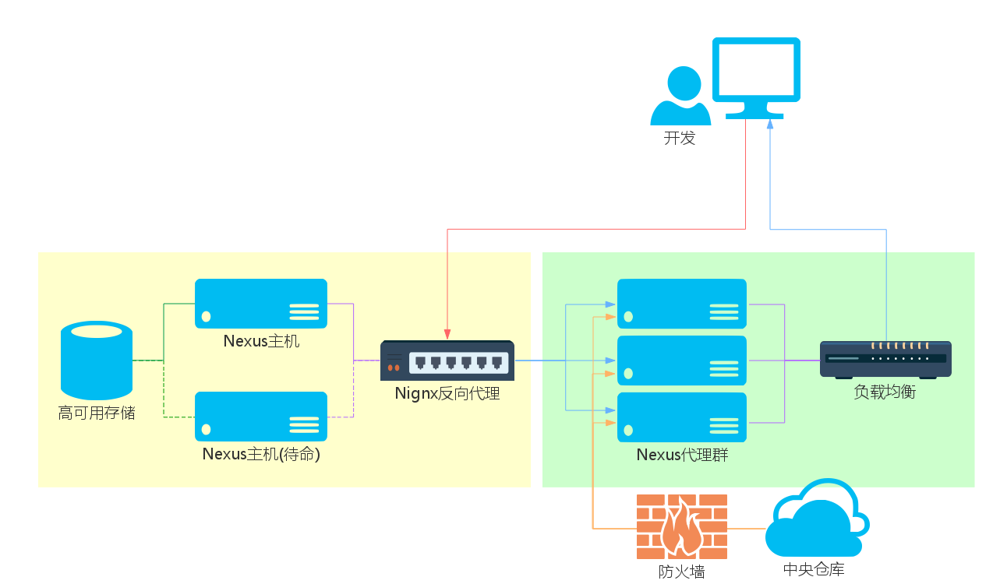

# 高级版

如果团队的人数更多，单个Nexus OSS的吞吐量会成为瓶颈。这时我们可以增加Nexus“缓存”缓存来解决。结构如下：

整个私服由两部分组成：
* 左侧黄色内部交付件存储部分，仅用于交付件存储和发布，用户只能发布交付件到此。
* 右侧绿色Nexus代理群部分，用户通过这部分完成搜索和拉取（包括内部交付件和中央仓库上的交付件）

高级版具有这样的特点：
* 高可用存储方案，保障交付件存储空间文件不丢失，存储服务不间断
* 代理集群保障文件检索拉取服务不间断
* 读取分离
* 结构简单易维护

### 交付件存储部分
左侧部分用来提供企业自己开发的交付件的存储，结构和基本版一致。用户只能通过帐号发布交付件到此仓库，但不能通过这部分来搜索和拉取交付件(**TBD**)。用户会同通过另外的代理部分来简介的搜索和拉取在这里存储的交付件。

它和基础本相比，精简了以下部分和改动：
1. 不允许匿名用户，用户只能通过右侧代理群间接访问
2. 提供一个帐号供代理群访问
2. 不行需要通过代理访问中央仓库，这部分由Nexus代理群完成
由此带来的好处是功能更加精简，管理和备份更容易，同时也降低了风险。

### 代理群
右侧代理群由多台等价的Nexus OSS服务作为代理。单个服务器的配置和基本版一致：
1. 四核CPU
2. 4G以上内存
3. 100G磁盘空间(用于存放Nexus安装文件和工作目录)
4. LINUX操作系统
5. Oracle Java 8

Nexus的配置应该还要包括：
1. 可以通过代理访问中央仓库
2. 可以通过特殊帐号访问内部仓库

其中一台通过Web界面完成配置，其他所有服务从此服务上同步配置文件。

### 负载均衡
**TBD**
