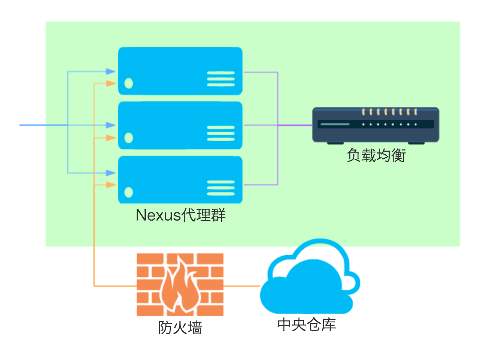

# 代理集群

详细方案：
* Nexus代理群是多台Nexus OSS服务  
  - 考虑使用容器技术降低Nexus服务部署的繁琐
* 每个Nexus OSS服务应该具备的配置
  - 匿名搜索Artifact
  - 匿名访问Artifact
  - 配置访问中央仓库的HTTP代理
* 每个Nexus OSS服务都要添加代理
  - 配置中央仓库代理
  - 配置私服Nexus主机代理
* 选择合适的负载均衡

http://minibiti.blogspot.com/2012/03/private-repositories-in-sonatype-nexus.html
https://support.sonatype.com/hc/en-us/articles/213465518-Sonatype-Nexus-Security-Cookbook
