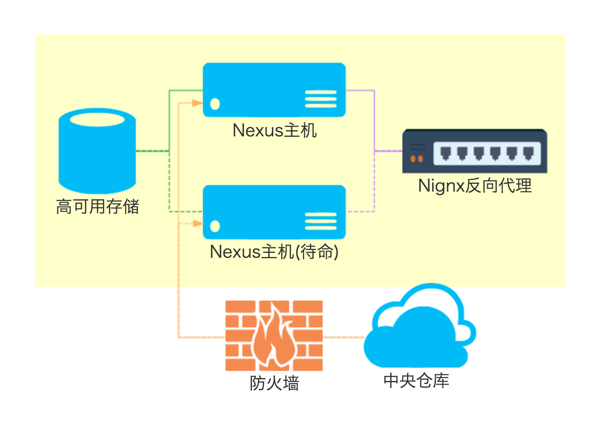

# 基本版

基本版使用了最少的服务器，提供了可靠的存储和最基本的冷备，其结构如下



Nexus OSS使用文件系统而不是数据库系统来存储交付件文件和其他一些信息（索引等）；并且由于其大量使用Luncene，除了二进制文件的存储以外，多个Nexus实例无法共享存储。因此，无法通过运行多个Nexus实例共享一套存储的方式实现高可用。

根据Nexus的工作目录结构，保证企业内自己开发的交付件有可靠的存储。此方案把Hosted的企业内部交付件存储挂载到高可用存储。

两台等价Nexus OSS服务器保持工作目录文件的同步，一台激活提供服务，另一台待命。

使用Nignx反向代理，一旦激活的服务器出现问题，可以快速切换到待命服务器，借此保障高可用性。

### 两台等价的Nexus OSS服务器
这两台服务器具有一致的配置，硬件，操作系统和Java的被指参考[官方建议](参考(https://support.sonatype.com/hc/en-us/articles/213464208-Sonatype-Nexus-System-Requirements)：
1. 四核CPU
2. 4G以上内存
3. 100G磁盘空间(用于存放Nexus安装文件和Proxy缓存，Hosted交付件应当挂载高可用存储)
4. LINUX操作系统
5. Oracle Java 8(新版本的Java可以提高Nexus的性能)

Nexus的配置需要注意：
1. 可以通过代理访问中央仓库
2. 工作空间挂载：
   **nexus/storage(hosted)** 挂载到独立高可用存储
3. 屏蔽覆盖发布的功能，**不允许重新发布同样坐标的交付件**（GAVCP完全一致）  
   ```交付件一旦发布后就不应该再发生变化。重新发布的原因是原来的交付件有问题。如果出现这样的状况，首先应该立即修复并发布一个新版本并通知到团队更新；然后通知管理员删除原来有问题的版本。```

4. 权限分为三个角色，发布者，开发者，管理员
 * **管理员** 超级用户，负责Nexus管理，包括仓库增删改查，代理配置，日志查看，定时任务配置，索引数据重建
 * **匿名用户** 使用Nexus上的交付件作为依赖开发，只能搜索和查看交付件，只能查看储仓库
 * **发布者** 用于把交付件上传到Nexus仓库
5. Hosted仓库分为

### 两台服务器配置同步
需要在两台服务器之间同步Nexus工作空间，包括了以下目录：
* **nexus/conf** 配置文件
* **nexus/log** 日志文件
* **nexus/timeline** 重要系统事件
同步方法参考：http://blog.sonatype.com/2010/01/how-to-backup-nexus-configuration-and-repository-artifacts/

### Nignx反向代理
Nexus主机对于用户来说是透明的。用户通过唯一的域名访问。
方案参考：(http://lazy-sys-admin.blogspot.com/2012/11/install-sonatype-nexus-cluster.html)
**TBD**

### 高可用存储
高可用存储用于存储Hosted Repos的二进制文件。
建议磁盘空间：2T，数据来源(http://blog.sonatype.com/2012/01/sizing-nexus-how-much-space-do-you-need/)
**TBD**

### Nexus权限配置


### Hosted仓库
一般包括Release、Snapshots和ThirdParty。

### 代理仓库
按需配置
