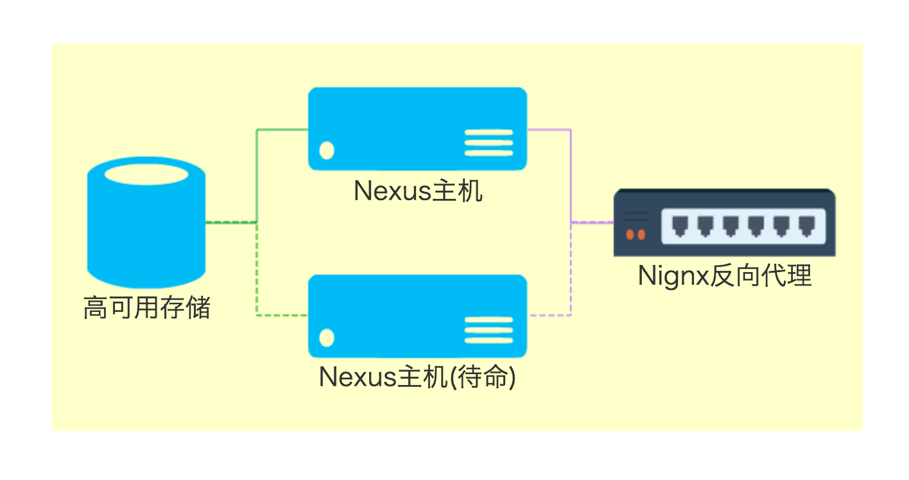

# Nexus主机

这个部分用来提供企业自己开发的交付件的存储。用户只能通过帐号发布交付件到此仓库，但不能通过这部分来搜索和拉取交付件(**TBD**)。用户会同通过另外的代理部分来简介的搜索和拉取在这里存储的交付件。

原因:
1. 除了发布权限，此Nexus主机服务对普通用户完全透明，即可能避免用户获取其他权限引起的误操作
2. 避免单台Nexus主机服务的访问吞吐量瓶颈，对于大规模组织来说，索引和拉取占操作的大头，单台服务难以满足
3. 功能保持简洁独立，无论是配置还是备份，操作更为简单

参考：http://lazy-sys-admin.blogspot.com/2012/11/install-sonatype-nexus-cluster.html
http://stackoverflow.com/questions/5345932/nexus-repository-manager

Nexus OSS使用文件系统而不是数据库系统来存储交付件文件和其他一些信息（索引等）；并且由于其大量使用Luncene，除了二进制文件的存储以外，多个Nexus实例无法共享存储。因此，无法通过运行多个Nexus实例共享一套存储的方式实现高可用。

根据nexus的工作目录结构，保证企业内自己开发的交付件有可靠的存储。此方案把Hosted的企业内部交付件存储挂载到高可用存储。

两台等价Nexus OSS服务器保持工作目录文件的同步，一台激活提供服务，另一台待命；使用Nignx反向代理，一旦激活的服务器出现问题，可以快速切换到待命服务器，借此保障高可用性。

### 两台等价的Nexus OSS服务器
这两台服务器具有一致的配置，建议：
1. 四核CPU
2. 4G以上内存
3. 100G磁盘空间(用于Nexus安装文件)
4. LINUX操作系统
5. Oracle Java 8(新版本的Java可以提高Nexus的性能)

参考(https://support.sonatype.com/hc/en-us/articles/213464208-Sonatype-Nexus-System-Requirements)

### Nignx反向代理
**TBD**

### 高可用存储
高可用存储用于存储Hosted Repo的二进制文件。
建议磁盘空间：2T，数据来源(http://blog.sonatype.com/2012/01/sizing-nexus-how-much-space-do-you-need/)
**TBD**
