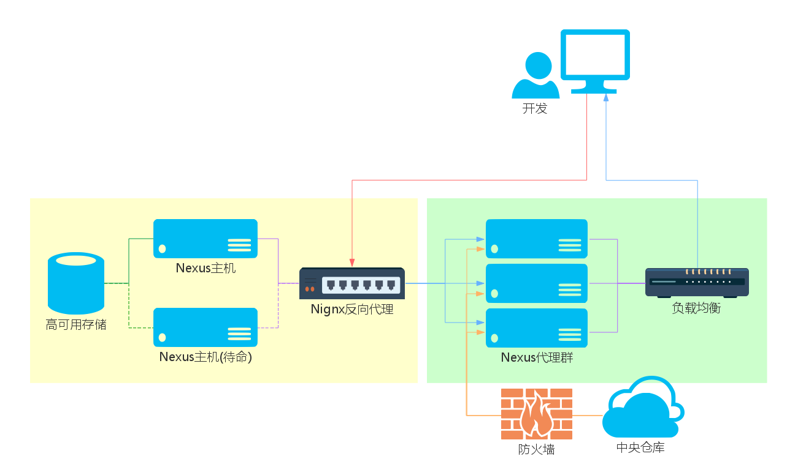

# 拓扑结构

整个方案采取Sonatype官方推荐的[方式](http://www.sonatype.org/nexus/2015/07/10/high-availability-ha-and-continuous-integration-ci-with-nexus-oss/), 使用多台Nexus OSS实例，结合负载均衡，高可用存储，组成一个仓库私服。具备这样的特点：
* 高可用存储方案，保障交付件存储空间文件不丢失，存储服务不间断
* 代理集群保障文件检索拉取服务不间断
* 读取分离
* 结构简单易维护

仓库私服的拓扑结构如下图：  

整个私服由两部分组成：
* 左侧黄色Nexus主机部分，交付件存储和发布服务，用户只能发布交付件到此。
* 右侧绿色Nexus代理部分，用户通过这部分完成搜索和拉取

接下来分两部分具体说明
